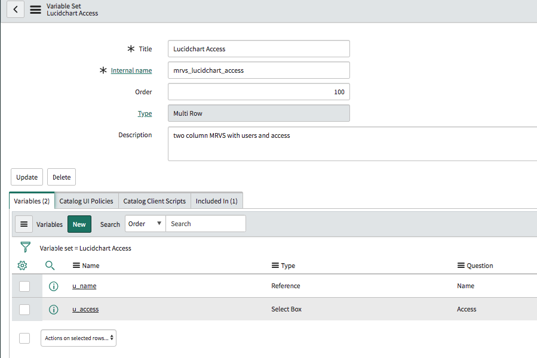
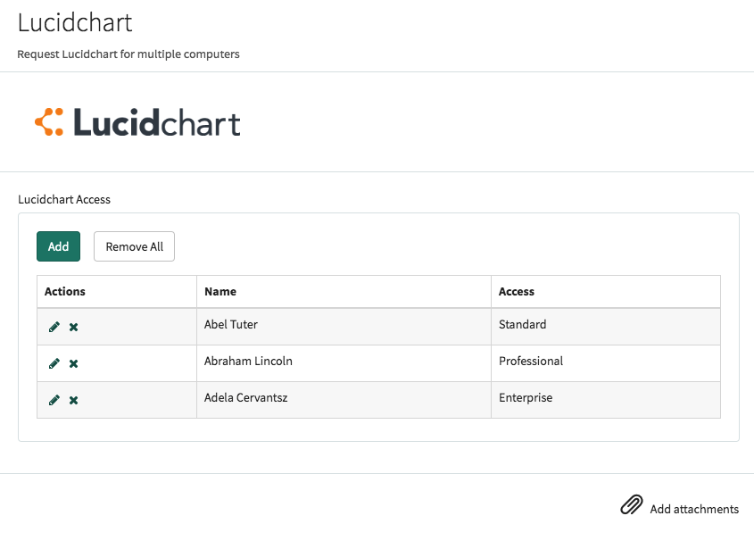
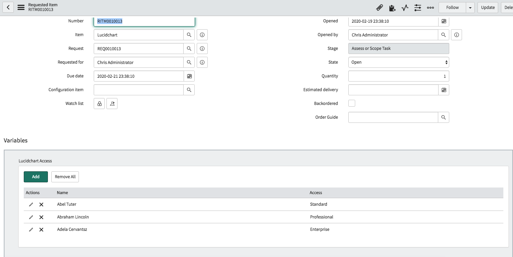
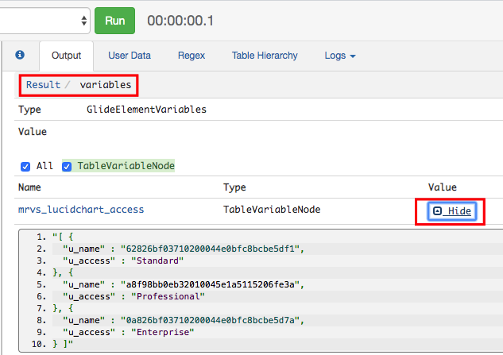
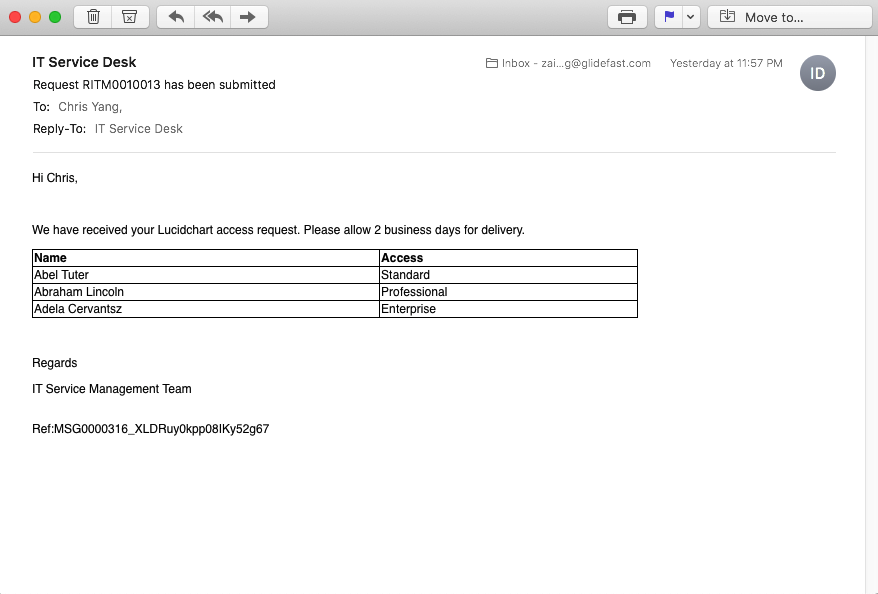

# Multi-Row Variable Sets
The Multi-Row Variable Set (MRVS) was a highly requested feature by the community, first introduced in the London release. MRVS enables users to group multiple variables into a single instance, allowing them to create as many instances as needed. A common use case for MRVS is in catalog items where requests must be made for multiple individuals, each requiring different levels of access.

In this demonstration we will walkthrough:

1. Creating a MRVS and looking into the properties
2. The values stored in the MRVS variable
3. How to display MRVS values in a table format in notifications

## Creating an MRVS

So here I've a catalog item to request access to LucidChart. In the variable set related list section, we can create a new variable set. On the next screen we will select the multi-row variable set. We will name it Lucidchart access and save. Now similar to traditional variable sets, we can define the variables we want to group together, in this instance, we have two variables: name and access. Name is a reference field to our user table, and access is a select box variable that specifies whether the user should have standard, professional, or enterprise license.

1. Go to Service Catalog -> Maintain Items to create a new catalog item.
2. At the related list section at the bottom, click on the variable set tab and create a new variable set
3. Select Multi-Row Variable Set option
4. Populate the details of the MRVS



After all of this is configured, let's go submit one in our Service Portal. We can use the ADD button to create a new row for the MRVS we defined. We will give :

- Abel Tutor a standard license
- Abraham Lincoln a professional license
- Adela Cervantesz an enterprise license.



After checking out, let's see what it looks like in the platform. In the variables section, we can see the rows that we submitted from the portal. 



If we open the record up in xplore (a free SN developer tool, download update set [here](https://thewhitespace.io/applications/xplore-developer-toolkit/)), we can see the data structure stored for the MRVS.



As you can see, the data is stored in an array of objects, with the name and access properties for each object. However, since our name variable is a reference field, only the `sys_id` is store in this object. If the `sys_id` is all you need for your script, then we can definitely leverage this method. However for our purpose, we want to display the Name of the user in our notifications, and we would need the display value of the reference field instead of the `sys_id`. We can achieve with some additional queries on the `sc_multi_row_question_answer` table. Let's explore how to achieve this in the notification record.

## Notification

Here is the notification record that will trigger when a lucidchart access item has been submitted, and since we will be doing some scripting, we will create a mail script named `mrvs_lucidchart` to handle the output.

Next in the mail script, we can write the logic here, but since we want to make this script as reusable as we can, we will put it in a script include so we can leverage this functionality for future MRVS variables.
```javascript
// Email Script: mrvs_lucidchart

(function runMailScript(/* GlideRecord */ current, /* TemplatePrinter */ template,
	/* Optional EmailOutbound */ email, /* Optional GlideRecord */ email_action,
	/* Optional GlideRecord */ event) {

	var result = new notificationUtil().formatMRVS(current);
	template.print(result);

})(current, template, email, email_action, event);
```

<!--  -->

```javascript
// Script Include: notificationUtil

var notificationUtil = Class.create();
notificationUtil.prototype = {
    initialize: function() {},
	
	//Display Multi-Row Variable Set in a table
	formatMRVS : function(current) {
	
		var headers = getMrvsHeaders(current);
		var values = getMrvsValues(current, headers.length);
		var result = "";
		result += "<head><style>table, th, td {border: 1px solid black; text-align:left;}</style></head>";
		result += '<body><table style="border-collapse: collapse; width:75%"><tbody>';
		result += headers.html; // Print headers
		result += values; // Print values
		result += "</tbody></table></body>";
		return result;
	},

    type: 'notificationUtil'
};

function getMrvsHeaders(gr) {
    var multiVar = new GlideRecord('sc_multi_row_question_answer');
    multiVar.addQuery('parent_id', gr.sys_id.toString());
    multiVar.addQuery('variable_set','!=','');
    multiVar.orderBy('row_index');
    multiVar.orderBy('sc_item_option.order');
    multiVar.query();
    var headers = {
        length: 0,
        html: "",
        arr: []
    };
    while(multiVar.next()) {
        if(headers.arr.indexOf(multiVar.item_option_new.getDisplayValue()) === -1) {
            headers.arr.push(multiVar.item_option_new.getDisplayValue());
            headers.html =  headers.html + "<th>" + multiVar.item_option_new.getDisplayValue() + "</th>";
            headers.length++;
        }
    }
    headers.html = "<tr>" + headers.html + "</tr>";
    return headers;
}

function getMrvsValues(gr, headerLength) {
    var multiVar = new GlideRecord('sc_multi_row_question_answer');
    multiVar.addQuery('parent_id', gr.sys_id.toString());
    multiVar.addQuery('variable_set','!=','');
    multiVar.orderBy('row_index');
    multiVar.orderBy('sc_item_option.order');
    multiVar.query();
    var values = [];
    while(multiVar.next()) {
        values.push(getDisplayValue(multiVar.value.toString(), multiVar.item_option_new));
    }
    var result = "";
    for(var i = 0; i < values.length; i++) {
        result += i % headerLength == 0 ? "<tr><td> " + values[i] + " </td>" : "<td> " + values[i] + " </td></tr>";
    }
    return result;
}

function getDisplayValue(rawValue, question){
    var varType = question.type.toString(), varRefTable = question.reference.toString();
    if(varType == 8){ // Type == Reference
        
        var gr = new GlideRecord(varRefTable);
        gr.get(rawValue);
        
        return gr.getDisplayValue();
    }
    
    else if(varType == 3 || varType == 5){ // Type == Multiple Choice or Select Box
        
        var variableName = question.name.toString();
        var questionID = question.sys_id.toString();
        
        var qc = new GlideRecord("question_choice");
        qc.addQuery("question", questionID);
        qc.addQuery("value", rawValue);
        qc.query();
        
        if(qc.next()){
            return qc.text;
        }
    } else {
        return rawValue;
    }
}
```

n the script include, we’ve created a function that returns the HTML code for the email. You can style this in any way you like, but I chose a table format since it mirrors the appearance in both the platform and the portal. As mentioned earlier, the questions and answers for the MRVS are stored in the `sc_multi_row_question_answer` table, which we'll leverage to display the values for our users.

In this table, the question field references the variable definition, which identifies the table the `sys_id` belongs to. From there, we simply run a GlideRecord query on that reference table to retrieve the display value. Shoutout to my colleague, Top Tanti, for helping out with this part.

The final result is a clean, well-formatted table displaying the users and their access levels in the notification!

